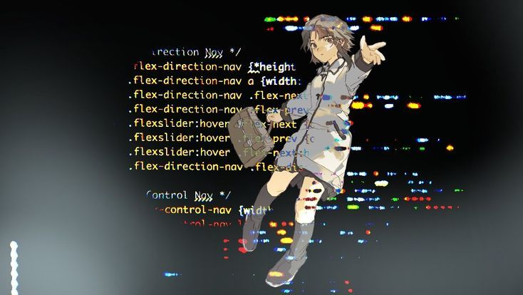

# 💫 About Me:
A student who wants to be successful in the future through the IT field

## 🌐 Socials:
    

# 💻 Tech Stack:
          
# 📊 GitHub Stats:
 
 

### ✍️ Random Dev Quote

### 🔝 Top Contributed Repo

---

<!-- Proudly created with GPRM ( https://gprm.itsvg.in ) -->
